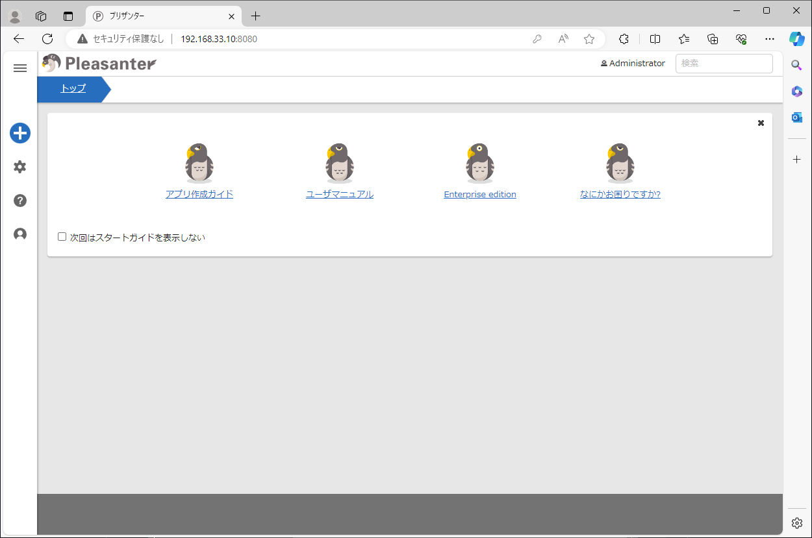

# pleasanter_docker_compose

## 概要
* 無料で使える OSS のノーコード・ローコード開発ツールの [Pleasanter](https://pleasanter.org/) をとりあえず docker compose で動かしてみる
* compose.yml は公式の [GitHub - Implem.Pleasanter](https://github.com/Implem/Implem.Pleasanter
) の Quick Start を Compose ファイルに落とし込んだもの
* .env は試すだけならそのままでも問題無いが、公開ポートなど必要があれば変更すること

## 操作

1. 起動  
    ```
    docker compose up -d
    ```
    ※起動直後は DB 構築などしているので、少し待ってあげて...

1. アクセス  
    http://localhost:8080  
    ※実際の URL は環境や設定に合わせてください。  
    ※初期ID: `Administrator` PW: `pleasanter`
    

1. 停止  
    ```
    docker compose stop
    ```

1. 破棄  
    DB のデータは破棄しない場合
    ```
    docker compose down
    ```
    DB のデータも破棄する場合
    ```
    docker compose down -v
    ```

## Quick Start を手動で試した時のメモ
※一部変更しないと動かなかったので残します（2024/4/10時点）

1. Create docker network
    ```
    docker network create pleasanter-net
    ```

1. Run PostgreSQL
    ```
    docker run --rm -d \
        --network pleasanter-net \
        --name db \
        --env POSTGRES_USER=postgres \
        --env POSTGRES_PASSWORD=postgres \
        --env POSTGRES_DB=postgres \
        postgres:15
    ```
    ※`POSTGRES_PASSWORD=<Any Sa password>` を `POSTGRES_PASSWORD=postgres` に変更

1. Environment variables  
    以下を `env-list` というファイル名で保存
    ```
    Implem.Pleasanter_Rds_PostgreSQL_SaConnectionString=Server=db;Database=postgres;UID=postgres;PWD=postgres
    Implem.Pleasanter_Rds_PostgreSQL_OwnerConnectionString=Server=db;Database=#ServiceName#;UID=#ServiceName#_Owner;PWD=postgres
    Implem.Pleasanter_Rds_PostgreSQL_UserConnectionString=Server=db;Database=#ServiceName#;UID=#ServiceName#_User;PWD=postgres
    ```
    ※`PWD=<XXXX>` を全て postgres に変更

1. Run CodeDefiner
    ```
    docker run --rm --network pleasanter-net \
        --name codedefiner \
        --env-file env-list \
        implem/pleasanter:codedefiner _rds
    ```

1. Start Pleasanter
    ```
    docker run --rm --network pleasanter-net \
        --name pleasanter \
        --env-file env-list \
        -p 50001:8080 \
        implem/pleasanter
    ```
    ※公式では内部ポートが `80` となっているが `8080` なので変更

1. Terminate
    ```
    docker stop db
    docker network rm pleasanter-net
    ```
